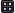

To download samples using the AWS CLI with a custom S3-compatible endpoint:

<code>
$ aws s3 sync --endpoint-url https://uk1s3.embassy.ebi.ac.uk --no-sign-request s3://idr/zarr/v0.4/idr0062A/6001240.zarr/ 6001240.zarr
</code>

<table class="display table" id="table">
    <thead>
<!-- TODO: should be read from data file -->
        <tr>
            <th>OME-NGFF version</th>
            <th>Thumbnail</th>
            <th>EMBL-EBI S3 key</th>
            <th>SizeX</th>
            <th>SizeY</th>
            <th>SizeZ</th>
            <th>SizeC</th>
            <th>SizeT</th>
            <th>Axes</th>
            <th>Wells</th>
            <th>Fields</th>
            <th>Keywords</th>
            <th>License</th>
            <th>Study</th>
            <th>DOI</th>
            <th>Date added</th>
        </tr>
    </thead>
    <tbody>



{{ rec[s3key] | split: "/" | last }}
{{ image_name | split: "." | first}}
        <tr>
            <td>{{ rec["OME-NGFF version"] }}</td>
            <td>
                
            </td>
            <td>
                <a href="{{ rec[s3key] }}">
                    {{ image_name }}
                </a> 
                <button class="no_border" title="Show download options" onclick="showS3Options('{{ rec[s3key] }}', '{{ image_name }}')">
                    
                </button>
                <!-- vizarr supports Plate or Non-bioformats2raw images -->
                
                
                
                
                
                
                
                
                
            </td>
            <td>{{ rec["SizeX"] }}</td>
            <td>{{ rec["SizeY"] }}</td>
            <td>{{ rec["SizeZ"] }}</td>
            <td>{{ rec["SizeC"] }}</td>
            <td>{{ rec["SizeT"] }}</td>
            <td>{{ rec["Axes"] }}</td>
            <td>{{ rec["Wells"] }}</td>
            <td>{{ rec["Fields"] }}</td>
            <td>{{ rec["Keywords"] }}</td>
            <td>{{ rec["License"] }}</td>
            <td>
                <a href="https://idr.openmicroscopy.org/search/?query=Name:{{ rec[studykey] }}">
                    {{ rec["Study"] }}
                </a>
                 
                
                    
                
                    
                
            </td>
            <td>{{ rec["DOI"] }}</td>
            <td>{{ rec["Date added"] }}</td>
        </tr>

    </tbody>
</table>

<!-- Modal for S3 options -->

    

        

            <h3 style="margin: 0;" id="s3OptionsTitle">Download Options</h3>
            <button onclick="closeS3Options()" style="background: none; border: none; font-size: 24px; cursor: pointer;">&times;</button>
        

        

            

                <h4 style="margin: 0;"><a href="https://ome-zarr.readthedocs.io/en/stable/index.html" target="_blank" style="color: #0066cc; text-decoration: underline;">ome-zarr</a> CLI Command:</h4>
                

                    <button onclick="copyFromDataset(document.getElementById('omeZarrCommand'))" style="padding: 6px 12px; cursor: pointer; background: #0066cc; color: white; border: none; border-radius: 3px; font-size: 12px;">
                        Copy
                    </button>
                

            

            <code id="omeZarrCommand" style="display: block; padding: 10px; background: #f5f5f5; border-radius: 3px; overflow-x: auto; white-space: nowrap;"></code>
        

        

            

                <h4 style="margin: 0;">AWS CLI Command:</h4>
                

                    <button onclick="copyFromDataset(document.getElementById('awsCliCommand'))" style="padding: 6px 12px; cursor: pointer; background: #0066cc; color: white; border: none; border-radius: 3px; font-size: 12px;">
                        Copy
                    </button>
                

            

            <code id="awsCliCommand" style="display: block; padding: 10px; background: #f5f5f5; border-radius: 3px; overflow-x: auto; white-space: nowrap;"></code>
        

        

            

                <h4 style="margin: 0;">S3 Endpoint URL:</h4>
                

                    <button onclick="copyFromDataset(document.getElementById('s3Endpoint'))" style="padding: 6px 12px; cursor: pointer; background: #0066cc; color: white; border: none; border-radius: 3px; font-size: 12px;">
                        Copy
                    </button>
                

            

            <code id="s3Endpoint" style="display: block; padding: 10px; background: #f5f5f5; border-radius: 3px; overflow-x: auto;"></code>
        

        

            

                <h4 style="margin: 0;">S3 URL:</h4>
                

                    <button onclick="copyFromDataset(document.getElementById('s3UrlText'))" style="padding: 6px 12px; cursor: pointer; background: #0066cc; color: white; border: none; border-radius: 3px; font-size: 12px;">
                        Copy
                    </button>
                

            

            <code id="s3UrlText" style="display: block; padding: 10px; background: #f5f5f5; border-radius: 3px; overflow-x: auto;"></code>
        

        

            

                <h4 style="margin: 0;"><a href="https://zarr.readthedocs.io/en/stable/" target="_blank" style="color: #0066cc; text-decoration: underline;">Zarr-Python</a>:</h4>
                

                    <button onclick="copyFromDataset(document.getElementById('pythonCodeInOptions'))" style="padding: 6px 12px; cursor: pointer; background: #0066cc; color: white; border: none; border-radius: 3px; font-size: 12px;">
                        Copy
                    </button>
                

            

            <pre id="pythonCodeInOptions" style="margin: 0; padding: 15px; background: #f5f5f5; border-radius: 3px; overflow-x: auto;"></pre>
        

    

